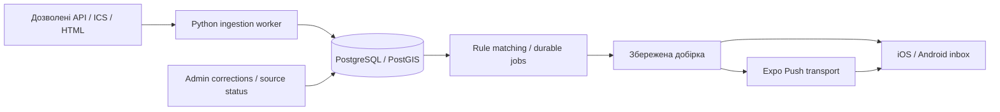

# Архітектура Event Radar

Вимоги: [MVP_PLAN.md](../MVP_PLAN.md), докази вибору: [REPO_AUDIT.md](REPO_AUDIT.md). Актуальна контрольна точка — S7; попередні секції описують стан відповідних етапів. Latest status і blockers — у PROGRESS.md.

## Реалізовано у S2

- Local Supabase CLI 2.34.3 (`event-radar-local`), PostgreSQL 17.4/PostGIS 3.3.7, відтворювані migrations + seed. 19 public tables, RLS увімкнений на всіх. Public catalog read-only для anon/authenticated; raw source_records та ingestion_runs server-only; private rows owner-only. Entitlements/digests/jobs/deliveries client read-only. Compound parent+owner FKs не дозволяють прив'язати приватний child до чужого parent.
- Profiles створює auth trigger. Signup metadata приймає лише allowlisted locale; не успадковує role/tier. Окремі locale/translation_locale і validated IANA notification_timezone. PostGIS GiST indexes; occurrences розрізняють known UTC / date_only / unknown, без вигаданого midnight чи нульової ціни.
- Email/password signup + confirmation OTP, login, captured-email recovery OTP + password update, foreground refresh, session restoration, logout, explicit deletion confirmation. SECURITY DEFINER RPC `delete_my_account()` не приймає user ID і видаляє лише auth.uid(); всі private rows cascade, public catalog лишається. Сесії/refresh tokens також видаляє Auth cascade; вже виданий JWT живе до expiry, але не повертає видалені приватні rows.
- Supabase JS 2.117.2, typed generated DB contract; server credentials лише tooling/server. Native persistence — Expo SecureStore 15.0.8 із bounded UTF-8 chunks, serialized writes/atomic manifest, unit failure tests; фактичний device test unverified. Web — localStorage, без тверджень про native/keychain security. SDK storage/refresh pattern звірено з [official React Native guide](https://supabase.com/docs/guides/auth/quickstarts/react-native).
- Installed SDK default refresh coordination використано без deprecated custom `processLock`; звірено з [official migration](https://github.com/supabase/supabase-js/blob/master/packages/core/auth-js/migrations/lockless-coordination.md). Старий quickstart не є доказом актуальності кожного option; actual package/browser warnings враховані.
- Email OTP templates для local Mailpit; confirmed emails увімкнено, minimum password 10. [Email template API](https://supabase.com/docs/guides/auth/auth-email-templates), [Mailpit API](https://mailpit.axllent.org/docs/api-v1/). Локальний capture не є перевіркою зовнішнього SMTP/delivery чи staging environment.
- Повні mobile та admin UI uk/en/es; вибір мови persisted, переклад подій налаштовується незалежно, actual event translation відкладено до S6. Світла тема Uniwind узгоджена з light-only shell: dark system theme більше не робить outline labels невидимими.
- 4 original synthetic territories (ES/UA + Madrid/Kyiv centers) із demo IDs/provenance та 11 categories; boundary data і live events не імпортовані. Welcome показує demo marker. Auth не дає доступу до admin: admin лишається статичним shell до S10.

Rules/areas, digest/job/delivery/entitlement tables на S2 — **схема й privacy boundary**, без matching, scheduling, push, billing або adapters. JSON rule parameters ще не є повним validated S4/S7 contract. Розширення constraints/logic належить відповідним етапам; S3 не починався. Local real integration + browser QA pass; native auth/storage, external SMTP/staging і remote CI unverified.

## Стан на кінець S1 (історичний)

- `apps/mobile`: вибіркова адаптація Obytes, Expo SDK 54 / RN 0.81.5 / React 19.1, Expo Router, Uniwind, стартовий екран з кнопкою опису. Власні provisional IDs `app.eventradar.dev` / `app.eventradar.staging`; чужі owner/EAS/URLs/demo providers відсутні. Native projects генеруються, не зберігаються в Git.
- `apps/admin`: Vite + TypeScript, локальний статичний shell стану джерел. Відхилення від орієнтовного Next.js: S1 не потребує SSR, server API або дубльованого backend. CRUD/Auth належать наступним етапам.
- `services/ingestion`: Python 3.13, stdlib CLI `--check`, нуль adapters і жодного DB/network запиту. `uv.lock` фіксує dev tool Ruff; legacy community-calendar dependencies ще не імпортовано. Selective adaptation лишається рішенням для S3.
- Кореневий pnpm workspace/lock, окремий uv lock, development/staging env examples, EAS profiles, локальні перевірки й CI workflow. Supabase/Auth/переклади/події/push ще не реалізовано.
- Node 22.23.3 / pnpm 10.34.6. Сумісні overrides усунули critical/high findings. Для patched image-size 2 додано збережений MIT patch Metro 0.83.3: читання image bytes замість pathname, з regression test на реальному PNG. Metro resolver також зберігає внутрішні exports RN Web, щоб уникнути циклу Uniwind під час dev startup.

Одна moderate finding `decode-uri-component` залишається в Expo Router → query-string; це відкритий dependency backlog. Немає автоматичної підміни CJS пакета ESM major без сумісного upstream update. Browser startup, tests та JS exports перевірено; native builds, EAS і зовнішні інтеграції — unverified.

**Одна mobile основа: Obytes, адаптована з SHA `fd9b358ed11913d2a49fd9ffa6582fe03ba130e7`.** Початковий Expo 54/RN 0.81 stack має пройти сумісні dependency updates і повторні checks у S1; його поточний lock не прийнятий як production. Не змішувати з Simonstorms.

**Ingestion: Python worker, вибіркова адаптація community-calendar `9a6d60ff53b6ff900b39d9fafef3d2d5176599ec`.** Vendoring мінімальних modules із upstream SHA, patch notes, license; не запуск upstream shell-command registry і не import whole repo. Спершу allowlisted API/ICS adapters; HTML/browser лише коли дозволи й потреба підтверджені. Crawlee не є початковою залежністю.

## Майбутні компоненти

| Компонент | Відповідальність / межа |
| --- | --- |
| `apps/mobile` | Expo/React Native/TypeScript, iOS + Android, router, uk/en/es, feed/map/detail/rules/inbox/settings. Public API credentials лише після RLS; server-only secrets заборонені |
| `apps/admin` | Мінімальна web admin, орієнтовно Next.js; створювати тільки потрібний shell у S1, не CRUD наперед |
| `services/ingestion` | Python adapters → source records → typed normalization → occurrences/provenance. Окремий lock/runtime; AI optional enrichment, не умова доступності feed |
| `supabase` | PostgreSQL/PostGIS/Auth, migrations/RLS, server-owned jobs; локально або managed development/staging |
| Worker jobs | Один deployment/process спочатку; ingestion/scheduling handlers, DB lease/claim, retries/backoff/business keys, delivery receipts. Cron тільки будить worker |
| Maps | MapLibre RN, окремо обрані commercial-compatible tile/geocoder/boundary providers; dev client/native gate у S5 |
| Billing | RevenueCat + App Store/Google Play, серверні entitlements, reconcile/webhook idempotency у S9 |
| AI | Один провайдер через adapter, structured output/schema validation, model ID із реального доступу, кеш event version/locale і budget cap у S6 |

У S0 ці каталоги не створювалися: імпорт mobile, worker/admin shell, env, locks та CI — scope S1.

## Контракти, які не успадковуємо зі starter

- Джерело визначає provider/external_id, fetched_at, hash, canonical URL і дозволи; adapters мають allowlist host/ID, bounded timeout/size/retries, не довільний `scraper_cmd`.
- Event ≠ occurrence. Одна occurrence має кілька provenances; різні сеанси не зливаються через title. Стабільний identity переживає зміну часу/назви. Повторний ingest і job ідемпотентні.
- Known time → UTC timestamp + IANA zone; date-only лишається date-only, unknown time/price/language/location не заповнювати вигаданими значеннями. Invalid TZID → validation/review, не Los Angeles fallback.
- Географія — ISO countries, стабільні administrative IDs, provenance boundaries, PostGIS; рядкові US/Canada heuristics не використовувати як глобальний geo filter. Полігон 3–100 вершин без self-intersection; antimeridian підтримати або явно відхилити.
- Rule areas OR, categories OR, різні групи AND; rules union із dedup. Delivery schedule окремо від event horizon. IANA/DST: skipped local time → наступний доступний, repeated local time → один запуск; перепланувати після зміни timezone/rule.
- Private user data — owner RLS; admin/server credentials тільки worker/backend. Tokens прив'язані до current user/device; logout відв'язує. MMKV demo token storage не прийнятий як auth security implementation.
- Durable notification jobs: lease, business key, retries, log, receipt status, invalid token cleanup. Один digest логічно, транспорт без обіцянки exactly-once. Quiet hours/pause/opt-out серверні.
- Відсутність запису у feed не означає cancelled. Corrections/version history/provenance зберігаються при повторному імпорті.
- AI input — недовірені дані. Dates/addresses звіряти із джерелом; translations separate locale/version/provider; unknown facts не генерувати. Не переносити upstream prompts/model IDs.
- Free/Plus limits серверні; entitlement не доводиться клієнтським прапорцем. Operator/brand/prices не вигадувати.

Один worker + база достатні для початку. Redis/Kafka/окремий Node crawler не додаємо без виміряної потреби. GitHub Actions може запускати обмежений import, але не точний notification schedule і не автоматичний push коду.

## Локальна вертикальна частина S3 (початковий стан до завершення сценарію)

Оригінальний stdlib Python Madrid adapter нормалізує лише single-day non-recurring subset. Local Node orchestration отримує official JSON, запускає adapter і записує source/hash/event/occurrence/provenance через server client. Stable IDs для нових records, існуючі linked IDs зберігаються; повторний завершений імпорт не створює дублікатів. Runner навмисно local-only, послідовний, не production worker: multi-call writes не є одним atomic transaction; lease/concurrency/change-version для time changes/digest/push попереду. Mobile public RLS reader не містить server key. External SMTP не налаштований; локальний Mailpit capture імітує доставку лише всередині dev stack.

## Реалізований S3 workflow

Python stdlib adapter → Node local orchestrator → server-only `ingest_madrid` atomic RPC. Batch ≤2000 records, payload ≤8MiB, allowlisted official endpoint/record host, single transaction/advisory source lock. Source hash + derived values determine version; event and occurrence identities stable. 930 real records retained; city selection excludes 62 records without exact MADRID locality, без підміни території source label або радіусом. Explicit category taxonomy mapping, unknown facts not inferred.

`save_s3_rule(categories)` validates owner/category set and saves one Madrid simple rule + exact city area. `build_s3_digest(rule)` checks owner, enabled/validated S3 parameters, allowed/fresh source (<48h), city AND category OR, future known/date-only horizon [today,today+30). Deterministic selection identity includes rule/categories/date/occurrence versions/times. Atomic digest/items/job, concurrent taps serialized. Historical digest stores immutable membership; descriptions/status/details remain current. General S4 rule management and S7 schedules are absent.

Public read-only `list_s3_events` sorts date-only and timestamps together; mobile detail/saved/inbox/digest routes use typed public/owner clients only. Saved/inbox limits 100/50, catalog pages30; broader performance/full mobile UX remains S5. Account/Auth preserves S2 contracts, native notification observer only accepts UUID digest IDs and owner RLS validates content. Empty-string JSX guards fixed for RN Web/native compatibility.

Push: explicit native permission + own projectId/dev build + register RPC (token reassigned to current owner), profile opt-out checked by server sender. Web returns a localized device-build requirement without permission prompts. Fixture jobs never contact Expo; lease reclaims fixture only, deterministic delivery row prevents duplication after crash. Manual Expo sender logs ticket acceptance/rejection, DeviceNotRegistered cleanup, separate receipt query. `receipt_ok` is transport evidence, not observed device display. No automatic resend after ambiguous timeout; expired Expo claims/failed jobs need manual review. No claim of production scheduling, quiet hours, retries or actual native delivery. Official APIs: [SDK54 Notifications](https://docs.expo.dev/versions/v54.0.0/sdk/notifications/), [Expo send/receipts](https://docs.expo.dev/push-notifications/sending-notifications/), [PostgREST transaction-scoped function timeout](https://docs.postgrest.org/en/stable/references/transactions.html).

## S4 — validated rules and union matching

`rules.filters.scope=s4` має separate validated contract: categories/languages arrays, budget+explicit currency, age bounds і boolean unknown policies. `event_horizon` — rolling days1–366 або inclusive ISO date range≤366 days, незалежно від delivery schedule; `rules.timezone` IANA. S4 delivery schedule/next_run scheduler не реалізовано. Fixed S3 contract збережений окремо для backward compatibility.

`save_s4_rule(document,id?)` SECURITY DEFINER checks auth.uid/owned S4 ID and bounded shape, validates SQL triggers, replaces settings/areas in one transaction. Owner advisory lock serializes this user's saves and pause. RLS grants owner SELECT/DELETE; S4 settings/area client writes disabled, legacy S2/S3 writes still owner-scoped. `set_s4_rule_enabled` validates owner, scope and boolean. Delete cascades areas and preserves old digest membership. RPC technical cap20 saved rules is a development resource guard; no billing/entitlement claim before S9.

Areas: country/admin/city uses stable territory IDs; geometry-dependent matching uses actual loaded boundary. Parent hierarchy is verified/curated membership, not inferred from source geographic label. Recursive UNION handles a repeated parent without an infinite traversal. Radius is geography ST_DWithin in metres (1–500000), with 1µm boundary tolerance for floating distance rounding. Custom polygon is geometry4326, distinct3–100 vertices and valid nonzero simple polygon; crossing±180 rejected with localized explanation. ST_Covers includes edge points. The server derives columns from JSON; caller cannot forge geometry columns. Existing PostGIS GiST indexes retained; realistic query-scale benchmarks belong to S11, not claimed here.

`s4_matches` is owner-filtered SECURITY INVOKER; enabled S4 rules only, actual scheduled/allowed/non-demo source/events, areas OR, categories OR, other groups AND. Unknown location cannot match spatial areas. Exact event-language code filter is independent of UI/translation; empty languages/categories and empty price/age settings disable the respective group. Budget requires one explicit currency, no cross-currency comparison. Age range overlap applies to complete known provider intervals; incomplete interval is unknown. Known timestamps compare local dates in rule timezone and must be future; date-only compared as a date, not fabricated midnight. Catalog may show stale data with checked_at; new digest requires source last_success within48h.

`list_rule_events` groups occurrences with matched rule IDs, chronological pages30. Manual `build_rule_digest` reads selection/version/time/settings/areas/freshness in a single snapshot, uses owner advisory lock + unique business key, stores ≤5000 deduplicated items and NO notification job. Digest client reads pages1000 (PostgREST cap) and verifies the owned digest exists before showing a manual-saved notice. This extends S3 manual persistence only; automatic schedules, per-rule grouping snapshots and push remain S7.

Minimal S4 map editor: React Native SVG15.12.1 (Expo54-compatible) + vendored pinned simplified Spain ADM1 JSON. Geographic coordinate canvas supports point entry/taps, zoom/recenter/undo and polygon outline. Outside Spain there is a grid, no claimed base-map coverage. Radius drawing is an approximate visual preview; authoritative selection uses PostGIS ellipsoidal distance. RN Web supplies normalized responder coordinates on `onPressIn`, native supplies final touch on `onPress`; fallback keyboard activation selects canvas center. Actual web pointer tested; native unverified. No GPS, tiles, geocoder, MapLibre or external coordinates transmission; full map UX/provider choices remain S5.

## S5 — один мобільний сценарій (2026-10-02)

- Головна `DiscoveryFeed` обирає owner union S4, коли є збережені правила, і public catalog, коли їх немає. Перемикач «Мої події / Усі події», literal case-insensitive server search назви/venue/description (≤120 characters), stable chronological pages30, total/mapped з того самого snapshot. `/matches` зберігається як redirect у цей сценарій. Старий `LiveEvents` S3 не використовується головною; його RPC contracts збережені для regression/історії.
- `list_s5_events` — narrowly scoped SECURITY DEFINER read RPC: catalog повертає тільки nondemo scheduled future occurrences від allowed sources; private match IDs лише у matches mode, через `s4_matches` / auth.uid(). Anonymous matches rejected. Координати тільки із реального events.location, NULL збережено; 0/0 — валідна точка. `s5_event_coordinates` — SQL invoker/public RLS для detail → map, без geocoding/inference.
- 4 кроки онбордингу: territory OR → category OR + independent event horizon → schedule preferences/IANA timezone → configuration preview. Чернетка в component memory, DB write тільки після явного «Створити й побачити події». Preview не є симуляцією matching; фактичні результати показуються після atomic save. Для radius/polygon/додаткових filters є повний editor.
- Мінімальна залежність S7: `save_s5_rule` атомарно зберігає validated S4 document/areas та validated delivery preferences; `set_s5_delivery_preferences` owner-only змінює preferences/timezone, не перезаписує filters/areas/horizon. `delivery_schedule.active=false`, `next_run_at=NULL`, jobs не створюються. UI прямо каже, що доставка вручну. Daily / weekdays ISO1–7 / interval1–366 calendar days з anchor date і HH:MM лише побажання, а не реалізований scheduler. DST/quiet hours/activation/retries залишаються S7; цей S5 trigger потрібно узгодити при S7 activation.
- MapLibre RN11.4.1 для native, MapLibre GL JS6.11.2 для web. New Architecture/Expo config plugin, обидва JS exports та isolated prebuild --no-install перевіряються; це не native compile/run. Початковий import GL JS6.11.2 мав `import.meta` SyntaxError у Metro. Усунуто через Expo Babel web unstable_transformImportMeta та explicit same-origin module worker URL. `prepare-map-assets.mjs` перед start/export копіює pinned worker/shared MJS + source maps/license із npm у ignored public/vendor; Expo export включає їх. Тимчасовий GL JS5.24.0 відхилено після critical XSS audit, downgrade не залишено. Кластерні labels використовують Noto Sans Regular із glyphs цього style. OpenFreeMap Positron: real remote vector basemap; не demo tiles. Commercial use allowed, no key, no SLA. Manual pan/zoom, event clusters/selection, draft polygon/radius overlays; offline S4 outline і explicit coordinate entry лишаються fallback у редакторі. Radius display uses spherical approximation; PostGIS/WGS84 remains authoritative.
- Map data capped first1000 results with explicit truncation notice; count/mapped стосуються всього запиту, а не лише завантаженого page. Події без location є у списку, не markers. Tile requests можуть передавати view/network information постачальнику; Auth/rule JSON не передаються. Attribution visible on web/native/editor. GPS permission не запитується й не є передумовою.
- Bottom navigation feed/map/saved/inbox/settings, rules in header; account/language/translation/timezone/push налаштовуються через settings/profile. Saved/inbox pages20 і focus reload, retry/empty/loading states. Feed page/search changes scroll to top. Current light-only theme; dark theme не пропонується. Labels/selected/busy states, ≥44px main button targets, semantic headings/inputs, keyboard and manual-map alternatives; native screen-reader/font-scale acceptance unverified.
- `/event/:occurrence`, `/digest/:id`, `/rule/:id`, `/delivery/:id` мають Expo Router deep links, owner reads/RLS; production universal links/domain association не налаштовані. `/map-preview` — explicit __DEV__-only synthetic renderer test, без DB writes, production redirect home. Fixture cluster proof не означає real-source coordinates.

S5 final mobile visual pass: returning users see compact «Події» heading and first event above the fold; language picker remains in settings, introductory text only for users without rules. This removes duplicate onboarding content from the active feed.

## S6 — джерела / factual cache, AI pending

Original stdlib Python adapters fetch only three reviewed HTTPS endpoints; redirect hosts, byte/page/row/session/time caps prevent arbitrary crawling. A loopback-only Node runner reads the local server key in memory from Supabase CLI, claims one source lease, validates a bounded batch and invokes atomic `ingest_s6_source`. It logs public counts/durations and error enums, never keys/raw error bodies. Cadence/due/backoff is durable DB state. Local `ingest:s6:watch` wakes every60s and runs sequential due-only cycles, with SIGINT/SIGTERM shutdown and bounded child/API requests; no deployed cron/service or S7 notification scheduler. PostgreSQL rollback errors release claims into backoff; ambiguous import responses retain the lease because the transaction may have committed. Retry after lease expiry remains idempotent and has no paid/AI side effects.

Registry `sources.code` / rights / cadence / TTL and private `source_poll_state` control imports. Transaction writes source record normalized hash, unchanged stable Madrid IDs, source provenance, event facts/version, occurrence, source-native translations, success/metrics and due state together. Hash includes public normalized facts/native translations, not fetch clocks/contact/images. Derived changes additionally invalidate versions even if a caller mistakenly reuses a hash. Each Toronto calendar row remains a distinct session; parent IDs are provenance, not automatic expansion. Explicit Helsinki cancellations update event/occurrence statuses; missing records never imply cancellation. Exact country/point/time/title/venue matches only create a private review candidate, never a merge.

Ready translations are visible only for current event version and permitted source. Detail uses independent profile translation locale, allows a local language choice without changing profile, shows origin (source vs AI) and always keeps original. Helsinki native English/summary is real source content. Private AI reservation/cache/accounting foundation now exists and is disabled by default; no actual provider adapter/calls. Provider/model access, pricing, daily currency/cap and server key must be provided/verified before integration can be completed. Lifecycle and limitations — [S6_AI.md](S6_AI.md). Unavailable translation does not block catalog/maps/original.

Public coverage RPC returns licence/checked time/partial coverage/counts/freshness; raw payloads/poll leases/run details/duplicate review are server-only. Direct detail RLS now respects blocked source rights too. Actual provider coordinates/explicit price fields supersede S5's unknown-value snapshot, with no guessed geometry/currency/range minimum/event language. Timezone-name constraint uses an indexed inventory of the same PostgreSQL accepted names; DST/offset conversions still use IANA-aware Python/PostgreSQL. Refresh inventory when DB tzdata changes.

S6 operational compatibility: `pnpm ingest:madrid:local` now delegates to the S6 Madrid runner with `--force`, preventing the old adapter from overwriting normalized facts/cache hashes. Legacy SQL RPC remains service-only for S3 rollback regressions; it is not the current operational import path.

S6 record freshness correction: new S4 union digests require BOTH source.last_success_at and every selected event.checked_at within that source TTL. A fresh partial batch does not validate older retained records. Existing stale catalog/details/historical selections stay readable with checked_at; no automatic cancellation/deletion. Legacy S3 selection also filters by source-specific source AND record TTL. Selection/version/freshness still share one MVCC snapshot.

S6 AI foundation: migrations027–029 add private settings/daily commitments/requests; cache identity includes version/locale/provider/model/prompt/input hash. Settings row locking serializes budget/dispatch/settlement; unknown cost retains ceiling, reported_cost staysNULL, repeated finish cannot charge twice. New translations metadata and RLS select only ready/current model/input. Provider-neutral prompt/output validator writes no normalized event facts. No provider SDK, network request runner or guessed model/pricing. Actual two-connection concurrency proof uses an isolated schema-only disposable database, not the user catalog.

## S7 — server calendar scheduling / durable selection and delivery

S7 implemented/local verified independently of blocked S6 AI. `s7_horizon_bounds` shared by owner matching and server scheduler; public wrapper binds auth.uid(), service-only core explicitly binds owner. `next_run_at`, schedule revision and stale retry persisted in rules. Calendar/DST resolved by PostgreSQL IANA inventory; first fold minute once, gap to earliest available minute, later fold quiet end. User edits and area changes reschedule/invalidate pending sends; legacy S5 inactive RPC preserved.

Scheduler transaction locks owner then rules, unions only due rules, writes immutable full item membership plus selected metadata/rule labels, user fingerprint ledger, unique due business key, journal and notification job, then advances next run. Empty/too-many advance without push; stale source or record defers same business slot by5min. Downtime coalesces missed slots. Every nonempty ready selection retained; unchanged items suppress push unless repeat selected. Source pipeline and AI remain independent.

S7 transport separate workflow from S3. Five-minute claim token fences dispatch; per-device attempt persisted before HTTP. Quiet/optout/revision/source/device rechecked before sending, unknown outcomes never automatically resent; definite rejection backoff bounded5claims/24h. Receipt queries wait15min/backoff/expire24h; late invalid receipt cannot delete freshly re-registered token. One sequential HTTP connection, paginated device IDs, digest UUID deep link uses existing owner-only route. Default local watch performs **inbox creation only**, real Expo send requires explicit operator command/configured own device. See [S7_ACCEPTANCE.md](S7_ACCEPTANCE.md) for detailed policy/proof/blockers. Local watcher availability is not a hosted cron deployment; S8 changes/reminders remain pending.

## S8 — transaction changes and saved-event reminders

`public.s8_state` stores the current important-field snapshot and monotonic occurrence revision. Deferred constraint triggers inspect final event+occurrence state, avoiding an event-write/time-write double alert in one import transaction. Initial migration seeds baselines; `checked_at`/version-only changes do not create alerts. Source omission leaves explicit facts/status untouched; dynamic `s8_availability` combines per-record/source TTL, unknown time/review and explicit cancellation.

Owner `s8_alerts` contain immutable before/after snapshots, kind, expiry, logical business key and optional digest reference. Owner preferences in `saved_events` are writable through authenticated `set_s8_saved_preferences`, without an owner argument; client direct preference/revision writes are prohibited. One-to-three distinct bounded minute offsets are planned only for known future instants. Changes reschedule by revision; date-only/unknown never gain invented times. Quiet hours use saved timezone and tested S7 DST boundaries. Pending ordinary updates respect pause; saved cancellation remains independent of entitlements.

Service-only `run_s8_scheduler` claims pending alerts using row locks/SKIP LOCKED; stale alerts defer5min, expired slots stop, one immutable digest/job is produced atomically. S8 jobs use existing S7 transport workflow, a composite owner/alert FK and a separate policy branch. Policy rechecks saved ownership, revisions, freshness/rights, push opt-out, quiet and expiry at claim/begin. Cancellation policy permits cancelled facts; reminder policy forbids them. Delivery TTL is min3600s/remaining expiry. Shared nonce/lease/per-device dispatch/settlement/receipts retain S7 uncertainty semantics. Provider-accepted push cannot be recalled; native OS delivery behavior unverified.

Private merged manual overlays/audit are service-only. `correct_s8_occurrence` acquires the same source advisory lock as ingestion before event/occurrence locks, preventing an in-flight import from reading stale overlays and undoing corrections. Import validates original provider records, retains original source hash/provenance, applies allowed overrides before normalized comparisons/writes. Provider-native translations are suppressed for corrected versions. Public detail only exposes a manual-correction presence badge; audit reasons remain private. Current live adapters normalize one individual session per event; future series/merge tooling needs separate review.

Local S8 watcher creates inbox records only by default, bounded50 alerts/cycle, wake60s, graceful shutdown. Optional Expo transport drains the shared S7/S8 queue, not S3. Free/Plus enforcement remains S9; full admin UI/roles remain S10. Acceptance and proof: [S8_ACCEPTANCE.md](S8_ACCEPTANCE.md).

Saved subscription identity is immutable (legacy same-key upsert still works). A server-owned random epoch changes after delete+save; it binds every alert and is part of the reminder business key. Pending work from an older saved instance cannot prevent new planning, and previously published jobs cannot revive after re-save, even if the preference revision again equals1. Snapshot timestamps are canonical UTC independently of caller PostgreSQL timezone. Both lifecycle and timezone invariants have SQL/API proof.
