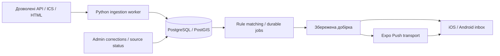

# Архітектура Event Radar

Вимоги: [MVP_PLAN.md](../MVP_PLAN.md), докази вибору: [REPO_AUDIT.md](REPO_AUDIT.md). Далі відділено реалізовану основу S1 від майбутніх компонентів MVP.

## Реалізовано у S1

- `apps/mobile`: вибіркова адаптація Obytes, Expo SDK 54 / RN 0.81.5 / React 19.1, Expo Router, Uniwind, стартовий екран з кнопкою опису. Власні provisional IDs `app.eventradar.dev` / `app.eventradar.staging`; чужі owner/EAS/URLs/demo providers відсутні. Native projects генеруються, не зберігаються в Git.
- `apps/admin`: Vite + TypeScript, локальний статичний shell стану джерел. Відхилення від орієнтовного Next.js: S1 не потребує SSR, server API або дубльованого backend. CRUD/Auth належать наступним етапам.
- `services/ingestion`: Python 3.13, stdlib CLI `--check`, нуль adapters і жодного DB/network запиту. `uv.lock` фіксує dev tool Ruff; legacy community-calendar dependencies ще не імпортовано. Selective adaptation лишається рішенням для S3.
- Кореневий pnpm workspace/lock, окремий uv lock, development/staging env examples, EAS profiles, локальні перевірки й CI workflow. Supabase/Auth/переклади/події/push ще не реалізовано.
- Node 22.23.3 / pnpm 10.34.6. Сумісні overrides усунули critical/high findings. Для patched image-size 2 додано збережений MIT patch Metro 0.83.3: читання image bytes замість pathname, з regression test на реальному PNG. Metro resolver також зберігає внутрішні exports RN Web, щоб уникнути циклу Uniwind під час dev startup.

Одна moderate finding `decode-uri-component` залишається в Expo Router → query-string; це відкритий dependency backlog. Немає автоматичної підміни CJS пакета ESM major без сумісного upstream update. Browser startup, tests та JS exports перевірено; native builds, EAS і зовнішні інтеграції — unverified.

**Одна mobile основа: Obytes, адаптована з SHA `fd9b358ed11913d2a49fd9ffa6582fe03ba130e7`.** Початковий Expo 54/RN 0.81 stack має пройти сумісні dependency updates і повторні checks у S1; його поточний lock не прийнятий як production. Не змішувати з Simonstorms.

**Ingestion: Python worker, вибіркова адаптація community-calendar `9a6d60ff53b6ff900b39d9fafef3d2d5176599ec`.** Vendoring мінімальних modules із upstream SHA, patch notes, license; не запуск upstream shell-command registry і не import whole repo. Спершу allowlisted API/ICS adapters; HTML/browser лише коли дозволи й потреба підтверджені. Crawlee не є початковою залежністю.

## Майбутні компоненти

| Компонент | Відповідальність / межа |
| --- | --- |
| `apps/mobile` | Expo/React Native/TypeScript, iOS + Android, router, uk/en/es, feed/map/detail/rules/inbox/settings. Public API credentials лише після RLS; server-only secrets заборонені |
| `apps/admin` | Мінімальна web admin, орієнтовно Next.js; створювати тільки потрібний shell у S1, не CRUD наперед |
| `services/ingestion` | Python adapters → source records → typed normalization → occurrences/provenance. Окремий lock/runtime; AI optional enrichment, не умова доступності feed |
| `supabase` | PostgreSQL/PostGIS/Auth, migrations/RLS, server-owned jobs; локально або managed development/staging |
| Worker jobs | Один deployment/process спочатку; ingestion/scheduling handlers, DB lease/claim, retries/backoff/business keys, delivery receipts. Cron тільки будить worker |
| Maps | MapLibre RN, окремо обрані commercial-compatible tile/geocoder/boundary providers; dev client/native gate у S5 |
| Billing | RevenueCat + App Store/Google Play, серверні entitlements, reconcile/webhook idempotency у S9 |
| AI | Один провайдер через adapter, structured output/schema validation, model ID із реального доступу, кеш event version/locale і budget cap у S6 |

У S0 ці каталоги не створювалися: імпорт mobile, worker/admin shell, env, locks та CI — scope S1.

## Контракти, які не успадковуємо зі starter

- Джерело визначає provider/external_id, fetched_at, hash, canonical URL і дозволи; adapters мають allowlist host/ID, bounded timeout/size/retries, не довільний `scraper_cmd`.
- Event ≠ occurrence. Одна occurrence має кілька provenances; різні сеанси не зливаються через title. Стабільний identity переживає зміну часу/назви. Повторний ingest і job ідемпотентні.
- Known time → UTC timestamp + IANA zone; date-only лишається date-only, unknown time/price/language/location не заповнювати вигаданими значеннями. Invalid TZID → validation/review, не Los Angeles fallback.
- Географія — ISO countries, стабільні administrative IDs, provenance boundaries, PostGIS; рядкові US/Canada heuristics не використовувати як глобальний geo filter. Полігон 3–100 вершин без self-intersection; antimeridian підтримати або явно відхилити.
- Rule areas OR, categories OR, різні групи AND; rules union із dedup. Delivery schedule окремо від event horizon. IANA/DST: skipped local time → наступний доступний, repeated local time → один запуск; перепланувати після зміни timezone/rule.
- Private user data — owner RLS; admin/server credentials тільки worker/backend. Tokens прив'язані до current user/device; logout відв'язує. MMKV demo token storage не прийнятий як auth security implementation.
- Durable notification jobs: lease, business key, retries, log, receipt status, invalid token cleanup. Один digest логічно, транспорт без обіцянки exactly-once. Quiet hours/pause/opt-out серверні.
- Відсутність запису у feed не означає cancelled. Corrections/version history/provenance зберігаються при повторному імпорті.
- AI input — недовірені дані. Dates/addresses звіряти із джерелом; translations separate locale/version/provider; unknown facts не генерувати. Не переносити upstream prompts/model IDs.
- Free/Plus limits серверні; entitlement не доводиться клієнтським прапорцем. Operator/brand/prices не вигадувати.

Один worker + база достатні для початку. Redis/Kafka/окремий Node crawler не додаємо без виміряної потреби. GitHub Actions може запускати обмежений import, але не точний notification schedule і не автоматичний push коду.
