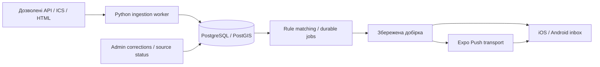

# Архітектура Event Radar

Вимоги: [MVP_PLAN.md](../MVP_PLAN.md), докази вибору: [REPO_AUDIT.md](REPO_AUDIT.md). Далі відділено реалізовану основу S1 від майбутніх компонентів MVP.

## Реалізовано у S2

- Local Supabase CLI 2.34.3 (`event-radar-local`), PostgreSQL 17.4/PostGIS 3.3.7, відтворювані migrations + seed. 19 public tables, RLS увімкнений на всіх. Public catalog read-only для anon/authenticated; raw source_records та ingestion_runs server-only; private rows owner-only. Entitlements/digests/jobs/deliveries client read-only. Compound parent+owner FKs не дозволяють прив'язати приватний child до чужого parent.
- Profiles створює auth trigger. Signup metadata приймає лише allowlisted locale; не успадковує role/tier. Окремі locale/translation_locale і validated IANA notification_timezone. PostGIS GiST indexes; occurrences розрізняють known UTC / date_only / unknown, без вигаданого midnight чи нульової ціни.
- Email/password signup + confirmation OTP, login, captured-email recovery OTP + password update, foreground refresh, session restoration, logout, explicit deletion confirmation. SECURITY DEFINER RPC `delete_my_account()` не приймає user ID і видаляє лише auth.uid(); всі private rows cascade, public catalog лишається. Сесії/refresh tokens також видаляє Auth cascade; вже виданий JWT живе до expiry, але не повертає видалені приватні rows.
- Supabase JS 2.117.2, typed generated DB contract; server credentials лише tooling/server. Native persistence — Expo SecureStore 15.0.8 із bounded UTF-8 chunks, serialized writes/atomic manifest, unit failure tests; фактичний device test unverified. Web — localStorage, без тверджень про native/keychain security. SDK storage/refresh pattern звірено з [official React Native guide](https://supabase.com/docs/guides/auth/quickstarts/react-native).
- Installed SDK default refresh coordination використано без deprecated custom `processLock`; звірено з [official migration](https://github.com/supabase/supabase-js/blob/master/packages/core/auth-js/migrations/lockless-coordination.md). Старий quickstart не є доказом актуальності кожного option; actual package/browser warnings враховані.
- Email OTP templates для local Mailpit; confirmed emails увімкнено, minimum password 10. [Email template API](https://supabase.com/docs/guides/auth/auth-email-templates), [Mailpit API](https://mailpit.axllent.org/docs/api-v1/). Локальний capture не є перевіркою зовнішнього SMTP/delivery чи staging environment.
- Повні mobile та admin UI uk/en/es; вибір мови persisted, переклад подій налаштовується незалежно, actual event translation відкладено до S6. Світла тема Uniwind узгоджена з light-only shell: dark system theme більше не робить outline labels невидимими.
- 4 original synthetic territories (ES/UA + Madrid/Kyiv centers) із demo IDs/provenance та 11 categories; boundary data і live events не імпортовані. Welcome показує demo marker. Auth не дає доступу до admin: admin лишається статичним shell до S10.

Rules/areas, digest/job/delivery/entitlement tables на S2 — **схема й privacy boundary**, без matching, scheduling, push, billing або adapters. JSON rule parameters ще не є повним validated S4/S7 contract. Розширення constraints/logic належить відповідним етапам; S3 не починався. Local real integration + browser QA pass; native auth/storage, external SMTP/staging і remote CI unverified.

## Стан на кінець S1 (історичний)

- `apps/mobile`: вибіркова адаптація Obytes, Expo SDK 54 / RN 0.81.5 / React 19.1, Expo Router, Uniwind, стартовий екран з кнопкою опису. Власні provisional IDs `app.eventradar.dev` / `app.eventradar.staging`; чужі owner/EAS/URLs/demo providers відсутні. Native projects генеруються, не зберігаються в Git.
- `apps/admin`: Vite + TypeScript, локальний статичний shell стану джерел. Відхилення від орієнтовного Next.js: S1 не потребує SSR, server API або дубльованого backend. CRUD/Auth належать наступним етапам.
- `services/ingestion`: Python 3.13, stdlib CLI `--check`, нуль adapters і жодного DB/network запиту. `uv.lock` фіксує dev tool Ruff; legacy community-calendar dependencies ще не імпортовано. Selective adaptation лишається рішенням для S3.
- Кореневий pnpm workspace/lock, окремий uv lock, development/staging env examples, EAS profiles, локальні перевірки й CI workflow. Supabase/Auth/переклади/події/push ще не реалізовано.
- Node 22.23.3 / pnpm 10.34.6. Сумісні overrides усунули critical/high findings. Для patched image-size 2 додано збережений MIT patch Metro 0.83.3: читання image bytes замість pathname, з regression test на реальному PNG. Metro resolver також зберігає внутрішні exports RN Web, щоб уникнути циклу Uniwind під час dev startup.

Одна moderate finding `decode-uri-component` залишається в Expo Router → query-string; це відкритий dependency backlog. Немає автоматичної підміни CJS пакета ESM major без сумісного upstream update. Browser startup, tests та JS exports перевірено; native builds, EAS і зовнішні інтеграції — unverified.

**Одна mobile основа: Obytes, адаптована з SHA `fd9b358ed11913d2a49fd9ffa6582fe03ba130e7`.** Початковий Expo 54/RN 0.81 stack має пройти сумісні dependency updates і повторні checks у S1; його поточний lock не прийнятий як production. Не змішувати з Simonstorms.

**Ingestion: Python worker, вибіркова адаптація community-calendar `9a6d60ff53b6ff900b39d9fafef3d2d5176599ec`.** Vendoring мінімальних modules із upstream SHA, patch notes, license; не запуск upstream shell-command registry і не import whole repo. Спершу allowlisted API/ICS adapters; HTML/browser лише коли дозволи й потреба підтверджені. Crawlee не є початковою залежністю.

## Майбутні компоненти

| Компонент | Відповідальність / межа |
| --- | --- |
| `apps/mobile` | Expo/React Native/TypeScript, iOS + Android, router, uk/en/es, feed/map/detail/rules/inbox/settings. Public API credentials лише після RLS; server-only secrets заборонені |
| `apps/admin` | Мінімальна web admin, орієнтовно Next.js; створювати тільки потрібний shell у S1, не CRUD наперед |
| `services/ingestion` | Python adapters → source records → typed normalization → occurrences/provenance. Окремий lock/runtime; AI optional enrichment, не умова доступності feed |
| `supabase` | PostgreSQL/PostGIS/Auth, migrations/RLS, server-owned jobs; локально або managed development/staging |
| Worker jobs | Один deployment/process спочатку; ingestion/scheduling handlers, DB lease/claim, retries/backoff/business keys, delivery receipts. Cron тільки будить worker |
| Maps | MapLibre RN, окремо обрані commercial-compatible tile/geocoder/boundary providers; dev client/native gate у S5 |
| Billing | RevenueCat + App Store/Google Play, серверні entitlements, reconcile/webhook idempotency у S9 |
| AI | Один провайдер через adapter, structured output/schema validation, model ID із реального доступу, кеш event version/locale і budget cap у S6 |

У S0 ці каталоги не створювалися: імпорт mobile, worker/admin shell, env, locks та CI — scope S1.

## Контракти, які не успадковуємо зі starter

- Джерело визначає provider/external_id, fetched_at, hash, canonical URL і дозволи; adapters мають allowlist host/ID, bounded timeout/size/retries, не довільний `scraper_cmd`.
- Event ≠ occurrence. Одна occurrence має кілька provenances; різні сеанси не зливаються через title. Стабільний identity переживає зміну часу/назви. Повторний ingest і job ідемпотентні.
- Known time → UTC timestamp + IANA zone; date-only лишається date-only, unknown time/price/language/location не заповнювати вигаданими значеннями. Invalid TZID → validation/review, не Los Angeles fallback.
- Географія — ISO countries, стабільні administrative IDs, provenance boundaries, PostGIS; рядкові US/Canada heuristics не використовувати як глобальний geo filter. Полігон 3–100 вершин без self-intersection; antimeridian підтримати або явно відхилити.
- Rule areas OR, categories OR, різні групи AND; rules union із dedup. Delivery schedule окремо від event horizon. IANA/DST: skipped local time → наступний доступний, repeated local time → один запуск; перепланувати після зміни timezone/rule.
- Private user data — owner RLS; admin/server credentials тільки worker/backend. Tokens прив'язані до current user/device; logout відв'язує. MMKV demo token storage не прийнятий як auth security implementation.
- Durable notification jobs: lease, business key, retries, log, receipt status, invalid token cleanup. Один digest логічно, транспорт без обіцянки exactly-once. Quiet hours/pause/opt-out серверні.
- Відсутність запису у feed не означає cancelled. Corrections/version history/provenance зберігаються при повторному імпорті.
- AI input — недовірені дані. Dates/addresses звіряти із джерелом; translations separate locale/version/provider; unknown facts не генерувати. Не переносити upstream prompts/model IDs.
- Free/Plus limits серверні; entitlement не доводиться клієнтським прапорцем. Operator/brand/prices не вигадувати.

Один worker + база достатні для початку. Redis/Kafka/окремий Node crawler не додаємо без виміряної потреби. GitHub Actions може запускати обмежений import, але не точний notification schedule і не автоматичний push коду.

## Локальна вертикальна частина S3 (початковий стан до завершення сценарію)

Оригінальний stdlib Python Madrid adapter нормалізує лише single-day non-recurring subset. Local Node orchestration отримує official JSON, запускає adapter і записує source/hash/event/occurrence/provenance через server client. Stable IDs для нових records, існуючі linked IDs зберігаються; повторний завершений імпорт не створює дублікатів. Runner навмисно local-only, послідовний, не production worker: multi-call writes не є одним atomic transaction; lease/concurrency/change-version для time changes/digest/push попереду. Mobile public RLS reader не містить server key. External SMTP не налаштований; локальний Mailpit capture імітує доставку лише всередині dev stack.

## Реалізований S3 workflow

Python stdlib adapter → Node local orchestrator → server-only `ingest_madrid` atomic RPC. Batch ≤2000 records, payload ≤8MiB, allowlisted official endpoint/record host, single transaction/advisory source lock. Source hash + derived values determine version; event and occurrence identities stable. 930 real records retained; city selection excludes 62 records without exact MADRID locality, без підміни території source label або радіусом. Explicit category taxonomy mapping, unknown facts not inferred.

`save_s3_rule(categories)` validates owner/category set and saves one Madrid simple rule + exact city area. `build_s3_digest(rule)` checks owner, enabled/validated S3 parameters, allowed/fresh source (<48h), city AND category OR, future known/date-only horizon [today,today+30). Deterministic selection identity includes rule/categories/date/occurrence versions/times. Atomic digest/items/job, concurrent taps serialized. Historical digest stores immutable membership; descriptions/status/details remain current. General S4 rule management and S7 schedules are absent.

Public read-only `list_s3_events` sorts date-only and timestamps together; mobile detail/saved/inbox/digest routes use typed public/owner clients only. Saved/inbox limits 100/50, catalog pages30; broader performance/full mobile UX remains S5. Account/Auth preserves S2 contracts, native notification observer only accepts UUID digest IDs and owner RLS validates content. Empty-string JSX guards fixed for RN Web/native compatibility.

Push: explicit native permission + own projectId/dev build + register RPC (token reassigned to current owner), profile opt-out checked by server sender. Web returns a localized device-build requirement without permission prompts. Fixture jobs never contact Expo; lease reclaims fixture only, deterministic delivery row prevents duplication after crash. Manual Expo sender logs ticket acceptance/rejection, DeviceNotRegistered cleanup, separate receipt query. `receipt_ok` is transport evidence, not observed device display. No automatic resend after ambiguous timeout; expired Expo claims/failed jobs need manual review. No claim of production scheduling, quiet hours, retries or actual native delivery. Official APIs: [SDK54 Notifications](https://docs.expo.dev/versions/v54.0.0/sdk/notifications/), [Expo send/receipts](https://docs.expo.dev/push-notifications/sending-notifications/), [PostgREST transaction-scoped function timeout](https://docs.postgrest.org/en/stable/references/transactions.html).
